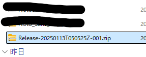
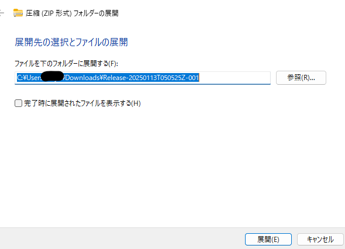
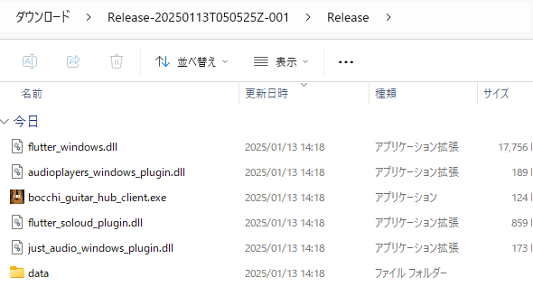
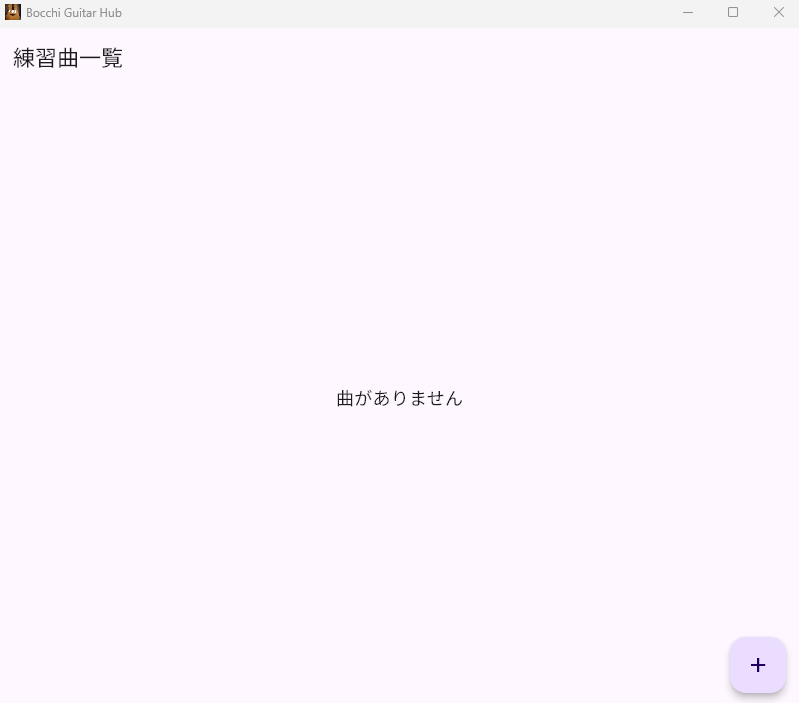
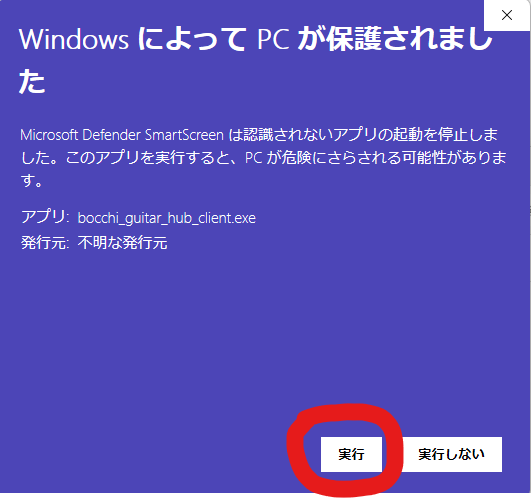
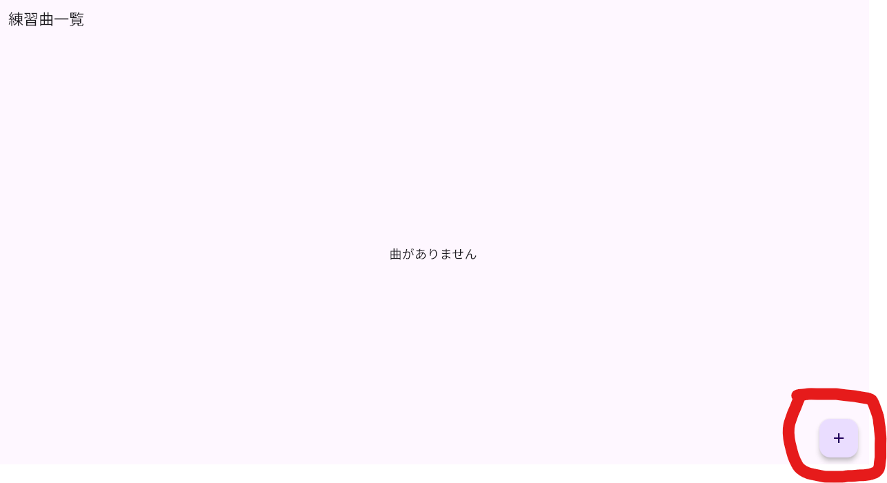
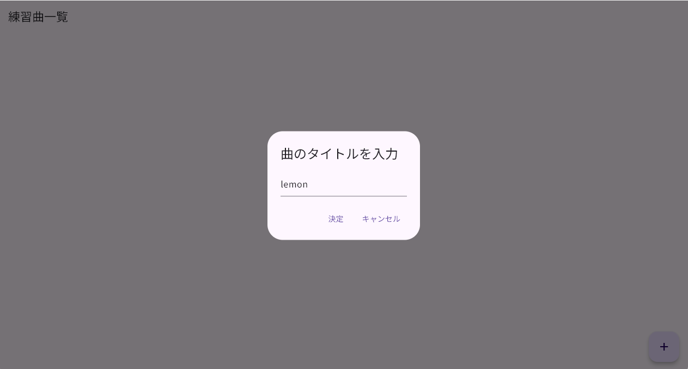
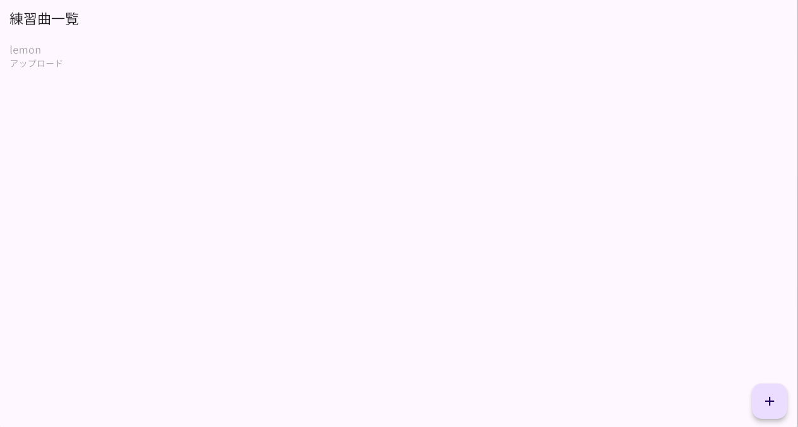

# 自動楽曲解析に基づくギター練習支援システム - Bocchi Guitar Hub -

クライアントアプリケーションの操作ドキュメント

## はじめに

本システムは主に以下の音楽要素を自動解析し、その結果をギター練習に活かします。

- パート別音源
- コード進行
- 音楽構成(イントロ、サビなどのセクション)
- ビート(メトロノームを鳴らすタイミングの指標)
- 歌詞

以上の音楽要素はバックエンドサーバで自動解析され、その結果に基づいてクライアントアプリケーションでギター練習のための機能を提供します。

## どんなギター練習が可能になるのか

以下の機能提供により、楽曲に合わせて演奏する練習をより効率的に、楽しいものにします。

#### 楽曲再生制御機能
- パート別音量調整
  - 自分の演奏パート（例：ボーカル・ギター）を消音することで、バンド演奏のような体験が可能となり、練習の楽しさを向上
- セクション選択
  - 特定のセクション(イントロ・サビ等)に再生位置を移動したり、リピート再生を可能とし、苦手箇所の練習を効率化
#### 演奏ガイド機能
楽曲の再生位置に同期して以下の情報をリアルタイムに確認が可能となり、楽曲に合わせた練習を効率化します。
  - コードダイアグラム表示
  - ビート表示
  - クリック音再生
  - 歌詞表示

## アプリのインストール方法

本アプリは以下のプラットフォームに対応しています。

- Windows
- Android

### 入手方法

以下のリンク先を開いてください
https://drive.google.com/drive/folders/1nef0nThpwiOO1uFiZLyzvqmSsPtZB6Bw

#### Windowsの場合

1. **Windowsリリース** フォルダの中にある
**Release** をダウンロードしてください。

2. ダウンロードされたZipファイルを適当な場所に展開してください。

3. 展開したフォルダを開き、**bocchi_guitar_hub_client.exe**というファイルをダブルクリックしてアプリが起動すればインストール成功です。

なお、**WindowsによってPCが保護されました**という表示が出た場合は以下の手順に従って起動してください。

#### Androidの場合

1. **Androidリリース** フォルダの中にある **app-release.apk** をダウンロードしてください。
2. ダウンロードしたapkファイルを開き、アプリのインストールを行ってください。

## アプリの使用方法

インストール完了時点では練習曲は一切入っていないため、最初に練習曲を追加する必要があります。その際、以下の拡張子のいずれかに該当する楽曲ファイルが必要となりますのでご用意ください。

- mp3
- wav
- aac
- flac
- ogg
- m4a

また、練習曲の追加にはバックエンドサーバでの楽曲解析処理を行うため、 **インターネットの接続環境** が必要となります。

処理に要する時間はバックエンドサーバの種類や混雑状況に依存します。バックエンドサーバは以下の通り2種類あり、GPUサーバ稼働時であれば約1分(混雑していなければ)で処理が完了します。

|| GPUサーバ | CPUサーバ |
| ---- | ---- | ---- |
|**接続優先順位**| 1 | 2 |
|**処理時間**| 1分 | 10分 |
| **稼働頻度** | 時々 | 常に |

### 1. 練習曲を追加

アプリ起動後に表示される **練習曲一覧** 画面の右下にある **＋ボタン** を押してください。

ファイルを選択できる画面(Windowsであればエクスプローラ)が開きますので、前述の拡張子に該当する楽曲ファイルを選択してください。

選択すると **曲のタイトルを入力** と表示されますので、**決定** を押してください。

**練習曲一覧**に先ほど入力したタイトルが追加されます。

追加後、楽曲ファイルがサーバにアップロードされます。その後、各楽曲解析処理がサーバで行われ、練習曲のタイトルの下に現在の処理状況が表示されます。全処理のステップは以下の通りです。

- コード進行解析
- パート別音源分離
- スペクトログラム抽出
- 音楽構造解析
- 歌詞解析

**※解析処理中にアプリを終了したりしても構いません！アプリを起動していなくても処理はサーバで続行されます！**

以上の処理終了後、各結果のダウンロードが始まります。それも完了すると、練習機能をご利用いただけるようになります。

