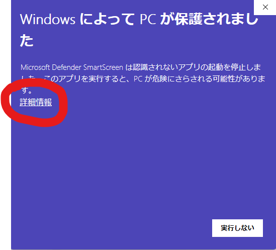
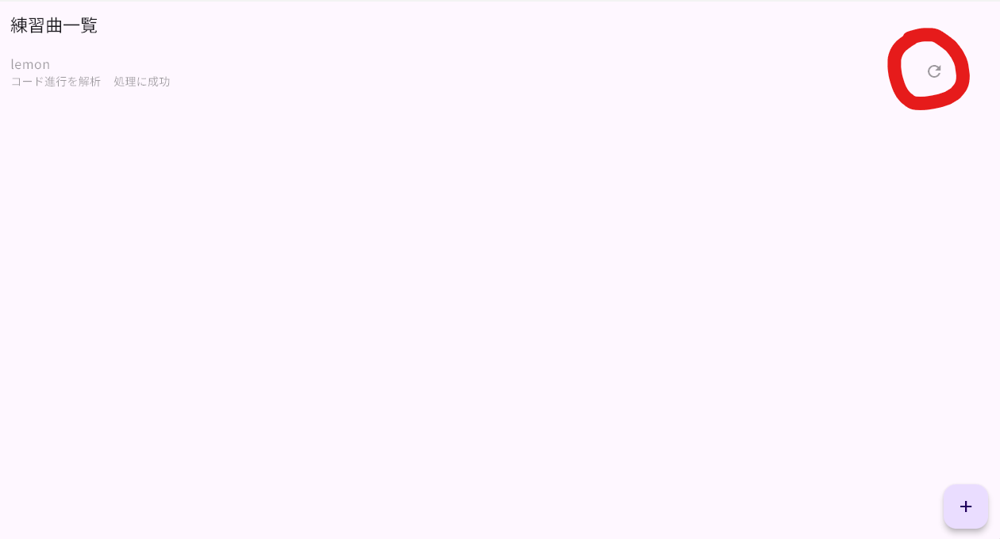
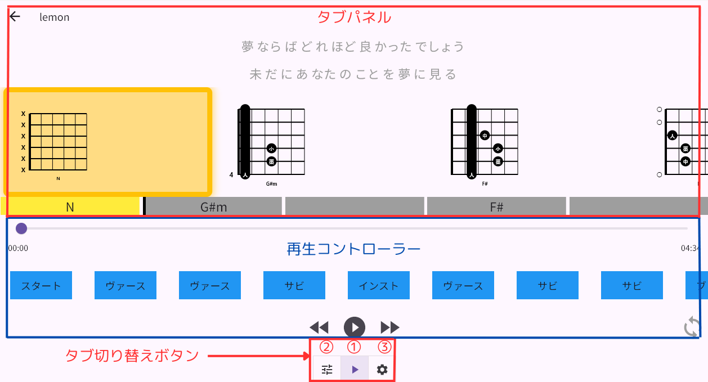
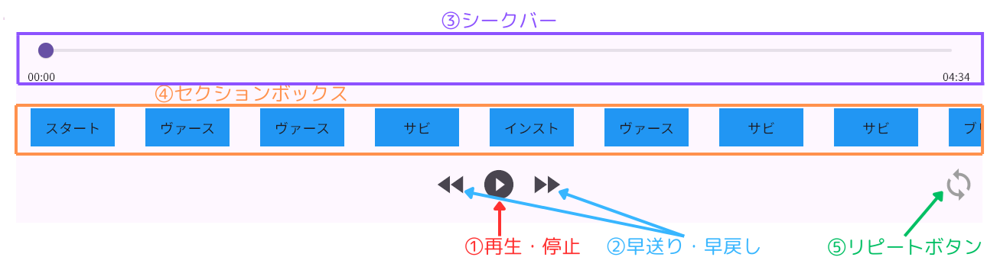
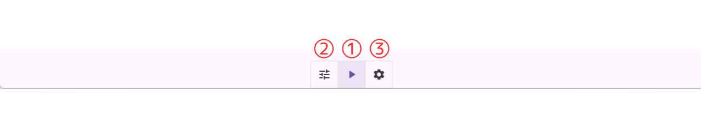
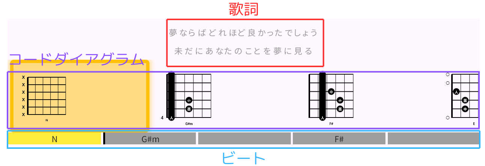
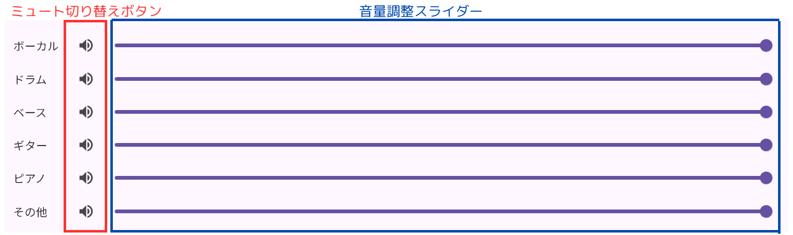
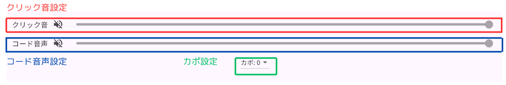

# 自動楽曲解析に基づくギター練習支援システム - Bocchi Guitar Hub -

クライアントアプリケーションの操作ドキュメント

## はじめに

本システムは主に以下の音楽要素を自動解析し、その結果をギター練習に活かします。

- パート別音源
- コード進行
- 音楽構成(イントロ、サビなどのセクション)
- ビート(メトロノームを鳴らすタイミングの指標)
- 歌詞

以上の音楽要素はバックエンドサーバで自動解析され、その結果に基づいてクライアントアプリケーションでギター練習のための機能を提供します。

## どんなギター練習が可能になるのか

以下の機能提供により、楽曲に合わせて演奏する練習をより効率的に、楽しいものにします。

#### 楽曲再生制御機能
- パート別音量調整
  - 自分の演奏パート（例：ボーカル・ギター）を消音することで、バンド演奏のような体験が可能となり、練習の楽しさを向上
- セクション選択
  - 特定のセクション(イントロ・サビ等)に再生位置を移動したり、リピート再生を可能とし、苦手箇所の練習を効率化
#### 演奏ガイド機能
楽曲の再生位置に同期して以下の情報をリアルタイムに確認が可能となり、楽曲に合わせた練習を効率化します。
  - コードダイアグラム表示
  - ビート表示
  - クリック音再生
  - 歌詞表示

## アプリのインストール方法

本アプリは以下のプラットフォームに対応しています。

- Windows
- Android

### 入手方法

以下のリンク先を開いてください
https://drive.google.com/drive/folders/1nef0nThpwiOO1uFiZLyzvqmSsPtZB6Bw

#### Windowsの場合

1. **Windowsリリース** フォルダの中にある
**Release** をダウンロードしてください。

2. ダウンロードされたZipファイルを適当な場所に展開してください。

3. 展開したフォルダを開き、**bocchi_guitar_hub_client.exe**というファイルをダブルクリックしてアプリが起動すればインストール成功です。

なお、**WindowsによってPCが保護されました**という表示が出た場合は以下の手順に従って起動してください。

#### Androidの場合

1. **Androidリリース** フォルダの中にある **app-release.apk** をダウンロードしてください。
2. ダウンロードしたapkファイルを開き、アプリのインストールを行ってください。

## アプリの使用方法

インストール完了時点では練習曲は一切入っていないため、最初に練習曲を追加する必要があります。その際、以下の拡張子のいずれかに該当する楽曲ファイルが必要となりますのでご用意ください。

- mp3
- wav
- aac
- flac
- ogg
- m4a

また、練習曲の追加にはバックエンドサーバでの楽曲解析処理を行うため、 **インターネットの接続環境** が必要となります。

処理に要する時間はバックエンドサーバの種類や混雑状況に依存します。バックエンドサーバは以下の通り2種類あり、GPUサーバ稼働時であれば約1分(混雑していなければ)で処理が完了します。

|| GPUサーバ | CPUサーバ |
| ---- | ---- | ---- |
|**接続優先順位**| 1 | 2 |
|**処理時間**| 1分 | 10分 |
| **稼働頻度** | 時々 | 常に |

### 1. 練習曲を追加

アプリ起動後に表示される **練習曲一覧** 画面の右下にある **＋ボタン** を押してください。

ファイルを選択できる画面(Windowsであればエクスプローラ)が開きますので、前述の拡張子に該当する楽曲ファイルを選択してください。

選択すると **曲のタイトルを入力** と表示されますので、**決定** を押してください。

**練習曲一覧**に先ほど入力したタイトルが追加されます。

追加後、楽曲ファイルがサーバにアップロードされます。その後、各楽曲解析処理がサーバで行われ、練習曲のタイトルの下に現在の処理状況が表示されます。全処理のステップは以下の通りです。

- コード進行解析
- パート別音源分離
- スペクトログラム抽出
- 音楽構造解析
- 歌詞解析

以上の処理終了後、各結果のダウンロードが始まります。それも完了すると、練習曲のタイトルが薄灰色から黒に変わってクリックできるようになり、練習機能をご利用いただけるようになります。

**※解析処理中にアプリを終了したりしても構いません！アプリを起動していなくても処理はサーバで続行されます！**

処理中にアプリを終了した場合、練習曲のタイトル右側に**リトライボタン**が表示されます。このボタンを押していただくことで、最新の処理状況を取得したり、処理が完了している場合は結果のダウンロードを始めることができます。

### 2. ギター練習

**練習曲一覧**画面から練習したい曲のタイトルをクリックすると、**練習**画面が開きます。**練習**画面は下図のように **再生コントローラー** ・ **タブ切り替えボタン** ・ **タブパネル** の3つの要素から構成されています。

### 再生コントローラー

**再生コントローラー**では、楽曲の再生を制御することができます。

**① 再生・停止**
- 楽曲を再生開始したり、一時停止ができます。
  
**② 早送り・早戻り**
- 現在の再生位置から10秒進めたり、戻すことができます。
  
**③ シークバー**
- ボタンをスライドさせることで再生位置を移動することができます。
  
**④ セクションボックス**
- セクション(イントロ・サビ)名が書かれた青いボックスをクリックすると、そのセクションの開始位置まで再生を移動することができます。
- 後述の**⑤ リピートボタン**を押した状態でセクションボックスをクリックすると、そのセクション区間がリピート再生されます。複数のセクションボックスを選択することも可能です。
  
**⑤ リピートボタン**
- このボタンを押すと、リピート再生モードになり、楽曲の再生終了後に再び再生が自動で始まるようになります。
- リピート再生モードの状態でセクションボックスを選択すると、選択したセクション区間がリピート再生されるようになります。

### タブ切り替えボタン

画面の下部中央には**タブ切り替えボタン**があり、ボタンを押すことで**タブパネル**の表示を切り替えることができます。

### タブパネル①

**タブ切り替えボタン** の真ん中①を選択すると表示されます。なお、最初に**練習画面**を開いたときも、①が選択された状態となっているため自動で開きます。
このタブパネルでは、ギター演奏に必要な情報を提示してくれます。

#### 歌詞
- 文節単位で区切られた歌詞が、一度に2つ表示されます。上図の歌詞では「夢ならばどれほど良かったでしょう」と「未だにあなたのことを夢に見る」に該当します。そして、楽曲の再生位置に応じて、文節が自動でスクロールされます。
- カラオケのように楽曲の再生位置に応じて、歌詞の文字に赤いグラデーションが徐々に付きます。

#### コードダイアグラム
- ギターコードの押さえ方を図示化したコードダイアグラムが表示されます。楽曲の再生位置に応じて、コードダイアグラムが横方向に自動でスクロールされ、現在の再生位置に該当するコードダイアグラムは黄色くハイライトされます。
  
#### ビート
- ビートがボックスとして表示されます。楽曲の再生位置に応じて、現在のビートのボックスが黄色く染まります。
- ビートのボックス中央にはコード名が記載されており、コードチェンジのタイミングがわかるようになっています。
- 小節の頭に該当するビートのボックスは、ボックスの左の枠線が黒くなっています。

### タブパネル②

**タブ切り替えボタン** の左②を選択すると表示されます。このタブパネルでは、パート別の音量調整ができます。

#### ミュート切り替えボタン
- 該当のパートを消音したり、消音を解除できます。

#### 音量調整スライダー
- 該当のパートの音量を調整でき、スライダーを一番左にすると音量が0になり、右にすると音量が最大になります。

### タブパネル③

**タブ切り替えボタン** の右③を選択すると表示されます。このタブパネルでは、クリック音やコード音声の再生やカポの設定ができます。

#### クリック音設定
- クリック音(メトロノーム音)を楽曲に重ねて再生することができます。デフォルトでは消音状態になっています。

#### コード音声設定
- コード進行の解析結果に基づいて生成されたMIDI音声を楽曲に重ねて再生することができます。デフォルトでは消音状態になっています。

#### カポ設定
- カポタストの位置を切り替えることができます。デフォルトではカポの位置が0(カポを付けていない)状態になっています。